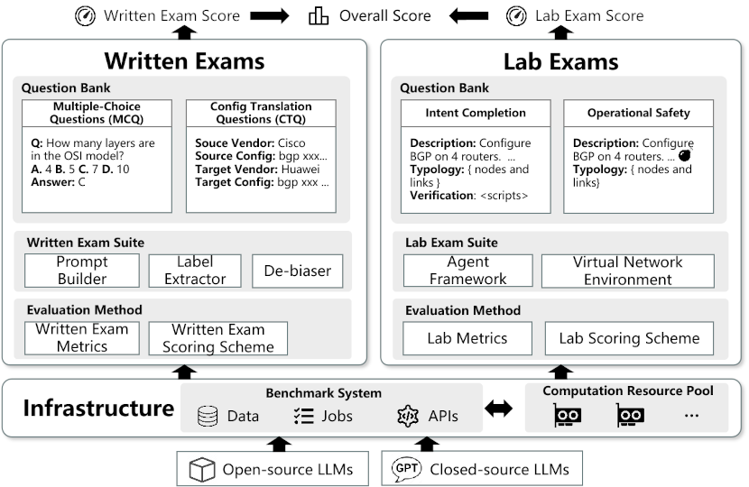

# LNB

This is the repository for paper *"Are LLMs Competent Network Operators? Benchmarking the Network Operations Capability
of Large Language Models with LNB"*. We provide both the datasets and the source code of the Benchmark System here.

## Datasets

The question banks for the written exams and the lab exams are provided
at [engine/data/question_bank](engine/data/question_bank).

## Benchmark System

As shown in the following figure, the Benchmark System consists of a **Data Management System ([dms](dms))** and a **Job
Execution System (jes)**.
The Job Execution System contains a subsystem for the Master Node ([jes/master](jes/master)) and a subsystem for each
Worker Node ([jes/worker](jes/worker)).
The worker nodes run the LLM inference with the **Inference Engine ([engine](engine))** in LLM Pods.

The **Inference Engine** contains the implementations of the core methods and tools for performing the benchmark on
written exams and the lab exams. We also put the question bank and other data in the engine for the convenience of
deployment. Please refer to [engine/README.md](engine/README.md) for details.

For details about the **Data management System**, please refer to [dms/README.md](dms/README.md).

For details about the **Job Execution System**, please refer to [jes/master/README.md](jes/master/README.md)
and [jes/worker/README.md](jes/worker/README.md).

## How to Use

We provide two ways to run the benchmarks.

### 1. Manually run the Inference Engine

This is for quick verification of all the supported benchmark tasks. You do not need to deploy the Data Management 
System or Job Execution System to run this engine. Please refer to [engine/README.md](engine/README.md) for details.

### 2. Post benchmark requests to System API

This requires all the systems running. Please first follow the `README.md` of the systems to complete the deployment.
Then, please use the [Data Management System APIs](dms/docs/apis/data_management_system_apis.md) to post benchmark
requests to the system.

**Note:** Currently, part of the tasks are not fully supported by the Job Execution System, thus you have to opt for the
manual run of the Inference Engine in some scenarios. We are making continuous efforts to accomplish the complete
support.  

